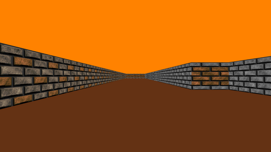

# 42 - CUB3D PROJECT
A graphics design project that required us to create a 3D graphical representation of the inside of a maze from a first-person's perspective with the use of ray-casting principles and practical mathematic equations.

This project was done in collaboration with [rrangwan](https://github.com/rrangwan)

## Sample Output

  
 <table>
  <tr>
    <td><b>Mandatory</b></td>
    <td><b>Bonus</b></td>
  </tr>
  <tr>
    <td></td>
    <td></td>
  </tr>
  <tr>
    <td></td>
    <td></td>
  </tr>
  <tr>
    <td></td>
    <td></td>
  </tr>
 </table>
  

## References
### Ray-Casting Tutorials
[Lode's Computer Graphics Tutorial - Ray Casting Part 1](https://lodev.org/cgtutor/raycasting.html) \
[F. Permadi's Ray-Casting Tutorial](https://permadi.com/1996/05/ray-casting-tutorial-table-of-contents/) \
[Vinicius Reif Biavatti's Ray Casting Tutorial](https://github.com/vinibiavatti1/RayCastingTutorial/wiki) \
[Video by 3D Sage - Make Your Own Raycaster Part 1](https://www.youtube.com/watch?v=gYRrGTC7GtA) \
[Video by javidx9 - Super Fast Ray Casting in Tiled Worlds using DDA](https://www.youtube.com/watch?v=NbSee-XM7WA) \
[Video by The Coding Train - Coding Challenge #146: Rendering Raycasting](https://www.youtube.com/watch?v=vYgIKn7iDH8) \
[Video by Pikuma - Math for Game Developers: Raycasting Wall Projection](https://www.youtube.com/watch?v=KjIyzJxlhzE)

### MiniLibX Documentation & Tutorial
[42 Docs by hsmits](https://harm-smits.github.io/42docs/) \
[Aurélien Brabant's Blog](https://aurelienbrabant.fr/blog)

### Event Key Codes
MacOS: [Christopher Kielty's List of AppleScript Key Codes](https://eastmanreference.com/complete-list-of-applescript-key-codes) \
Linux: showkey -a

### RGB Extraction & Conversion
[RGB to Hexadecimal](https://www.developintelligence.com/blog/2017/02/rgb-to-hex-understanding-the-major-web-color-codes/) \
[Hexadecimal to Decimal Converter](https://www.rapidtables.com/convert/number/hex-to-decimal.html)

### Texture Sources & Game Assets
[Wolfenstein 3D Texture Library](http://www.areyep.com/RIPandMCS-TextureLibrary.html) \
[Itch.io Website](https://itch.io/)
